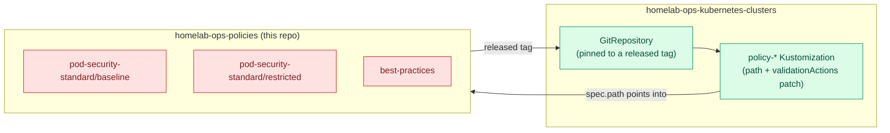
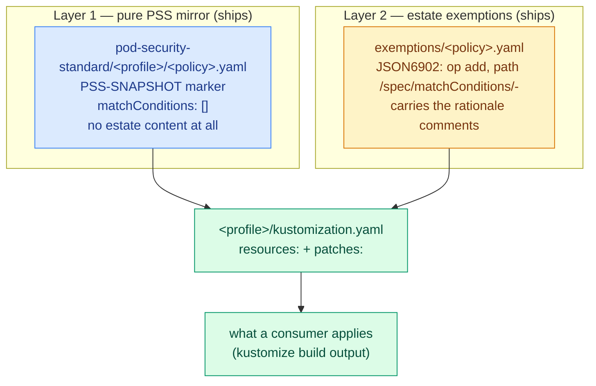

# Design

This document explains how this repository is structured and why: why it exists
separately at all, why the policy content is split into three groups and two
layers, what the migration off Kyverno's deprecated policy kinds changed, how
the two test tiers divide the work, and which decisions are deliberately still
open.

For *what* is here — the policy inventory, the consumer wiring, the release
mechanics — see [README.md](./README.md). For working conventions inside the
repo, see [CLAUDE.md](./CLAUDE.md).

## Why this is a separate repository

These policies used to live inside `homelab-ops-kubernetes-clusters`, alongside
that repo's per-cluster Flux wiring. They were split out because they are not
cluster wiring: the same policy text applies to every cluster, it has no
`GitRepository`, no `dependsOn`, no `postBuild` variables, and nothing about it
is decided per cluster except which group a cluster subscribes to and in what
mode it enforces. Keeping it in the wiring repo meant a policy change and a
cluster change were the same reviewable unit and shipped on the same reconcile.

Split out, this repo is one more versioned artifact consumed exactly the way the
apps repo's modules are — a pinned tag, a `GitRepository`, a
`Kustomization.spec.path` — which means a policy change is reviewed on its own,
released on its own, and rolled out per cluster by bumping a tag.

That split is Phase 1 history and is not revisited here.

## The three policy groups

| Group | What it mirrors | Who consumes it |
| --- | --- | --- |
| `pod-security-standard/baseline` | Kubernetes PSS Baseline, as implemented in `pod-security-admission` | Every cluster |
| `pod-security-standard/restricted` | PSS Restricted; its `kustomization.yaml` lists `../baseline`, so it is a superset | Clusters that want the harder profile |
| `best-practices` | Nothing external — house rules | Every cluster |

**Why both PSS profiles rather than one.** Baseline and Restricted are
meaningfully different in strictness, and the estate subscribes to both — one
cluster to Restricted, one to Baseline only. Shipping only Restricted would
force the softer subscriber to carry a pile of exemptions that exist purely to
reconstruct Baseline; shipping only Baseline would leave the harder one with
nothing to point at. A consumer chooses by pointing at one directory, and
Restricted composes Baseline by inclusion rather than by duplication — so a
Baseline fix reaches both profiles by construction.

**Why `best-practices` is its own group and not a third PSS profile.** It is not
a profile of anything. Its policies do not derive from an external standard,
they are not tiered against each other, they are not all validations (three
mutate, two delete), and their exemptions are house judgment calls rather than
readings of a spec. That difference is not cosmetic: it is exactly why this
group keeps its exemptions inline while the PSS groups do not (see
[The exemption-patch seam](#the-exemption-patch-seam)). Folding these into a PSS
directory would put content with no reference implementation into files whose
whole value is being diffable against one.

## The policy-kind migration

Kyverno deprecated `ClusterPolicy` and `ClusterCleanupPolicy` in v1.17 and
removes them in v1.20. Their replacements are CEL-based and VAP-shaped, and the
repo migrated wholesale rather than incrementally, because a mixed tree means
two idioms, two test harnesses, and a consumer-side enforcement patch that
matches half the policies.

| Legacy | Replacement | apiVersion |
| --- | --- | --- |
| `kyverno.io/v1 ClusterPolicy` with `validate` rules | `ValidatingPolicy` | `policies.kyverno.io/v1` |
| `kyverno.io/v1 ClusterPolicy` with `mutate` rules | `MutatingPolicy` | `policies.kyverno.io/v1` |
| `kyverno.io/v2beta1 ClusterCleanupPolicy` | `DeletingPolicy` | `policies.kyverno.io/v1` |

The mechanical translations that matter:

| Legacy | New |
| --- | --- |
| `spec.validationFailureAction: Audit` | `spec.validationActions: [Audit]` (`Enforce` → `[Deny]`; `Warn` also available) |
| `spec.rules[].match…resources.kinds` | `spec.matchConstraints.resourceRules[]` — apiGroups/apiVersions/operations/lowercase-plural resources |
| `exclude` (all forms) | an appended `spec.matchConditions[]` entry |
| `spec.rules[].preconditions` | `spec.matchConditions[]` |
| `validate.pattern` / `anyPattern` / `deny.conditions` | `spec.validations[].expression` (CEL) |
| `mutate.patchStrategicMerge` | `spec.mutations[].patchType: ApplyConfiguration` |
| `pod-policies.kyverno.io/autogen-controllers` | `spec.autogen.podControllers.controllers` |
| `ClusterCleanupPolicy.spec.conditions` (JMESPath) | `DeletingPolicy.spec.conditions[].expression` (CEL) |

This was a breaking change for consumers, which is why it is committed as
`feat!` and is meant to cut v1.0.0: a consumer's enforcement patch targets a
kind by name, and a patch whose target matches nothing is a silent no-op rather
than an error. The release and the consumer change are a coordinated pair.

Three consequences of the new shape are worth calling out, because they drove
the rest of this document:

- **CEL compile errors are a new failure class.** Hand-translated CEL can be
  silently wrong in ways a JMESPath pattern could not be, and `kyverno apply`
  reports a compile error on stdout while exiting in a way that looked like
  success to the old CI. Closing that blind spot came *before* any policy was
  translated (see [CI and validation](#ci-and-validation)).
- **Autogen became a hazard rather than a convenience.** Autogen rewrites
  `object.` to `object.spec.template.` throughout a policy — *including*
  `matchConditions` — so a metadata-based exemption silently stops matching when
  it is applied to a real controller. Every policy here therefore sets
  `spec.autogen.podControllers.controllers: []`. In Audit mode autogen was
  buying almost nothing (the same violation appears in reports, keyed on the Pod
  instead of the controller), so this removes a whole failure class at close to
  zero cost rather than managing it per policy.
- **`matchConditions` is a flat, policy-wide, ANDed list**, which is what makes
  the exemption layering below possible at all.

## Faithful mirrors: "upstream" means Kubernetes, not `kyverno/policies`

The PSS groups are mirrors, and the governing rule is that the thing being
mirrored is the Kubernetes `pod-security-admission` source — the code the
apiserver actually runs — and **not** `kyverno/policies`' own port of it, which
this migration repeatedly found to be a lagging interpreter. The kubernetes.io
PSS documentation page is also stale on several points; the check files are
authoritative. Every mirror file carries a `PSS-SNAPSHOT` marker naming what it
is synced to (Kubernetes 1.36 / PSS policy version v1.35) so the next resync has
a fixed diff point.

This is not a theoretical distinction. Three concrete places where following
`kyverno/policies` would have shipped something wrong:

- **`image` volumes in `restrict-volume-types`.** `check_restrictedVolumes.go`
  allows nine volume types; `image` was added to that list in Kubernetes 1.33 and
  is active at every enforce-version the estate pins. Upstream `kyverno/policies`
  still lists eight, in all three of its variants. This repo keeps `image`, and
  the policy file carries the full rationale plus an explicit warning never to
  resync this file wholesale from upstream — a freshly-generated file looks like
  fresh provenance while actually being a regression.
- **The `restrict-sysctls` allow-list.** PSS's safe-sysctl list grew from five
  entries to twelve between Kubernetes 1.22 and 1.32, as SIG-Node evaluated each
  one for kernel-namespacing safety. The pre-migration file carried the 1.22-era
  five, and upstream's CEL variant still does. A short list here is not extra
  safety margin — it is an out-of-date copy that flags legitimate in-network-namespace
  tuning. The list was hand-edited to twelve rather than copied.
- **`restrict-apparmor-profiles`, the exemplar for why any of this matters.**
  Upstream deleted this policy from both of its CEL trees — an editorial choice,
  not a signal that Kubernetes dropped the concept: `check_appArmorProfile.go`
  on `release-1.36` still enforces AppArmor as a Baseline control, and checks
  **two** channels, the `securityContext.appArmorProfile.type` field (added in
  1.30) *and* the deprecated `container.apparmor.security.beta.kubernetes.io/*`
  annotation. This repo's own pre-migration file checked only the annotation. So
  a pod setting `appArmorProfile.type: Unconfined` — the way anyone has written
  it since 1.30 — **passed this repo's policy and failed real Pod Security
  Admission**, quietly, for years. The rewritten policy checks both channels.
  That bug is what the pure-mirror layer exists to make findable: it was found by
  reading the mirror next to the check file, which is only possible if the mirror
  has no estate content mixed into it.

Other content deltas follow the same rule: `disallow-latest-tag` keeps all three
container lists where upstream's CEL rewrite regressed to `containers` only;
`cleanup-empty-replicasets` keeps the 24h age guard upstream's `DeletingPolicy`
rewrite dropped, because that guard is what preserves `kubectl rollout undo`;
`add-emptydir-sizelimit` keeps both of the guards upstream's rewrite dropped;
`add-ndots` keeps its idempotence precondition rather than adopting upstream's
version, which overrides a workload's own `ndots` setting.

The same principle also *adds* things. `disallow-host-probes-and-lifecycle` is
hand-authored from `check_hostProbesAndhostLifecycle.go` because PSS gained the
check at policy version v1.34 and upstream has no equivalent in any variant;
`disallow-selinux` gained `container_engine_t`, allowed since PSS v1.31; and
`disallow-proc-mount` / `require-run-as-nonroot` / `require-run-as-non-root-user`
gained the user-namespace relaxations PSS v1.35 introduced, paired with the new
`disallow-proc-mount-strict` that re-tightens `procMount` at the Restricted tier
exactly the way PSS's own override mechanism does.

## Two layers: pure mirror, then estate exemptions

Before the migration, one file held three complected concerns: the PSS rule, the
estate's exemptions from it, and Kyverno mechanics chosen *because of* those
exemptions. The migration rewrote every rule anyway, which made separating them
nearly free — and doing it later would have meant touching every file a second
time for no new information.

What the pure layer buys:

- **Diffability against the reference implementation.** A pure file can be read
  next to the corresponding `check_*.go` and the delta is zero, plus documented
  content notes. The AppArmor gap above is the failure mode this defends
  against.
- **Falsifiable rule correctness.** Offline fixtures assert PSS semantics with no
  exemption noise in the assertion.

`best-practices` deliberately does *not* get this treatment. There is no
external standard to diff those files against, so the split would buy nothing
and cost an extra file per policy — architecture theatre. Their exemptions stay
inline.

### The exemption-patch seam

The legacy kinds genuinely had no seam here: `exclude` blocks lived nested inside
positional `rules[]`, where an outside patch would have had to index into a list
whose order carried meaning. This repo's own guidance used to say, correctly for
that API, that exclusions were not meaningfully patchable from outside.

The new kinds change the premise. `spec.matchConditions` is a flat top-level
list of `{name, expression}` items (`DeletingPolicy` calls the same thing
`spec.conditions`), and **every entry is ANDed**. Each entry states when the
policy *should* apply, so an exemption is written as a negation, and an appended
entry can only ever remove resources from what the policy looks at. It cannot
weaken a validation expression, and it cannot reorder anything, because nothing
here is positional.

That is exactly the right failure mode for an exemption seam: the worst a
malformed append can do is narrow a policy too far, which a firing fixture
catches, rather than silently widen one. It is also composable — this repo
appends from `<profile>/kustomization.yaml`, and a consumer can append from its
own `Kustomization.spec.patches` with byte-identical content. Relocating an
exemption estate-side later is a file move, not a redesign.

Design choices inside the seam:

- **One mechanism, everywhere.** Exemptions are `matchConditions` entries — not
  `namespaceSelector`, not `objectSelector`, not `excludeResourceRules`. One
  place to look, one shape to test. (There is exactly one deliberate exception:
  `cleanup-empty-replicasets` uses `matchConstraints.namespaceSelector`, because
  `DeletingPolicy` is a different shape and that is the native VAP-shaped way to
  exclude a namespace by name.)
- **Every mirror declares `matchConditions: []`**, including policies with no
  exemptions, so the append path always exists. The empty list is accepted by
  both the CLI compiler and the live CRD.
- **`PolicyException` was considered and rejected**: it is namespaced (a
  cluster-side placement decision), needs consumer-side Kyverno configuration,
  and inherits the autogen problem rather than solving it. The patch seam gets
  the same separation with zero new runtime machinery.
- **Name matching concatenates `name` and `generateName`** —
  `(object.metadata.?name.orValue('') + object.metadata.?generateName.orValue(''))`.
  The justification for this is *narrower* than it first appears and is worth
  stating correctly, because the original design reasoned from an assumption that
  measurement falsified. The design said a controller-created Pod reaches
  admission with `generateName` and an empty `name`, so a name-only expression
  would stop firing live. Measured firsthand against a real cluster, that is not
  what happens: the apiserver generates the name *before* admission runs, so
  DaemonSet- and Deployment-created Pods arrive carrying both fields. A name-only
  expression would in fact have worked at live admission. The concatenation is
  kept anyway — it costs nothing and it covers shapes where only one field is
  present, notably offline `kyverno test` fixtures, which get no apiserver
  defaulting. What must not be repeated is the claim that live admission needs
  it.

### One policy per exemption-scope

`matchConditions` are policy-wide, which is a real constraint on file layout: a
policy carrying two rules with *different* exclusion sets cannot express them at
a policy-wide seam without pushing exemptions back inside validation expressions
and re-complecting the layers. Two policies were split for that reason:

- **`disallow-host-namespaces` → `disallow-host-network` + `disallow-host-pid` +
  `disallow-host-ipc`.** Three rules, three different exclusion sets: the
  `csi-driver-nfs` / `metallb-system` namespace exclusions applied only to the
  hostNetwork rule, `disallow-host-ipc` needed none at all.
- **`disallow-capabilities-strict` → `require-drop-all` +
  `disallow-capabilities-strict`** (the latter now the add-check only). The
  drop-ALL rule excluded `virt-handler*`; the add-check excluded nothing. Keeping
  them joined would have silently widened the virt-handler exemption to the
  add-check.

The cost is five PolicyReport names where there were two. A kind migration is
the natural and only cheap moment to rename report keys — single owner, Audit
mode, nothing consuming the names programmatically. PSS's own check granularity
(one `hostNamespaces` check) is about its internal bookkeeping, not a constraint
on how a mirror lays out files; fidelity means semantics, not file count.

## Test architecture: two tiers

Silently-wrong hand-translated CEL was the dominant risk of this whole project,
so the test tiers were built *before* the translation rather than after it, and
each policy's tests landed in the same change as its port.

| Concern | `kyverno test` (offline) | Chainsaw (kind cluster) |
| --- | --- | --- |
| Validation / mutation rule semantics | **owns** | spot-checks via good/bad pairs |
| Exemption expressions, including `generateName`-only shapes | **owns** | — |
| An exemption firing for a real controller-created Pod through real admission | — | **owns** |
| Policy readiness (webhook configured, RBAC granted) | cannot see it | **owns** |
| Behaviour under `[Deny]` (rules actually reject) | approximates via outcomes | **owns** (in-test patch to `[Deny]`; shipped authoring stays `[Audit]`) |
| Mutations landing on live objects (no Audit backstop) | approximates | **owns** |
| `DeletingPolicy` schedule firing + cleanup-controller RBAC | cannot see it | **owns** |
| `cleanup-empty-replicasets`' 24h age discrimination | **owns** (fixtures can declare `creationTimestamp`) | **cannot** — `creationTimestamp` is server-set, so a live test can only assert the negative |
| PSS user-namespace relaxation vs. its Restricted re-tightening | **owns** (the Skip/Fail pair) | optional spot-check |

The dividing rule is that **a Chainsaw test exists only where a live cluster
adds information the offline tier cannot produce.** Chainsaw is not a re-run of
the CLI suite on a cluster; that would double the runtime and halve the signal.
A policy with no Chainsaw directory is covered by the CLI tier plus its
profile's `ready-smoke` — one Chainsaw test per profile that applies the whole
built stream and asserts every policy reaches Ready, which is the cheapest
possible cluster-level catch for engine-level rejects across every policy at
once.

Both tiers run against the **built** output — `ci/scripts/build-policies.sh`
runs `kustomize build` per profile and splits the stream into one file per
policy. Testing only pure files would leave the exemption layer untested;
testing only built output would blur which layer broke; so rule fixtures may
target pure files while exemption fixtures target both, and every exemption's
firing fixture is asserted `skip` against the built policy *and* `fail` against
the pure one. An exemption whose patch target is mistyped is a silent kustomize
no-op, and that paired assertion is the only thing that catches it.

Two limits are worth recording because they shaped what could be proven:

- The offline tier **cannot assert that a resource was not matched at all** — no
  selector variant expresses it; unasserted extras pass silently. This mattered
  for `require-probes`, which was reworked to match Deployments, DaemonSets and
  StatefulSets directly instead of Pods; that it genuinely stopped touching bare
  Pods had to be shown by a live `kyverno apply` diff instead.
- The Chainsaw tier runs against a stock Kyverno chart install, whose default
  `resourceFilters` exclude ReplicaSets from every policy engine. Production
  overrides that; the suite works around it per-test. Aligning the harness with
  production is a fidelity improvement that has not been made.

## The regression tally

The migration rewrote every exemption in the repo from `exclude:` blocks into
CEL. The risk that carries is not that an exemption is translated wrongly —
fixtures catch that — but that one is quietly **dropped**, which no fixture can
catch, because a fixture for a missing exemption is also missing.

The tally is the check for that class: enumerate every exemption in the
pre-migration content, count it two ways, and require the post-migration tree to
match. A lower count is a bug, not a simplification. Concretely:

| Measure | Value |
| --- | --- |
| Distinct workload name-globs | **8** |
| Total name-glob occurrences | **27** |
| Namespace-exclusion occurrences | **9** |
| Distinct namespace values | **7** |

The name-globs, with their occurrence counts:

| Glob | Occurrences |
| --- | --- |
| `virt-handler*` | 10 |
| `virt-launcher*` | 4 |
| `kube-prometheus-stack-prometheus-node-exporter*` | 4 |
| `alloy*` | 2 |
| `intel-gpu-plugin-gpu-device*` | 2 |
| `metallb-speaker*` | 2 |
| `node-problem-detector*` | 2 |
| `cert-manager-cainjector*` | 1 |

The seven distinct namespace values are `csi-driver-nfs`, `dns`, `kube-system`,
`longhorn-system`, `metallb-system`, `system-upgrade` and `tailscale`. (Every
other namespace that appears in an exemption — `kubevirt`, `monitoring`,
`logging`, `cert-manager`, `intel-device-plugins`, `sandbox-docker`,
`sandbox-talos` — appears only as half of a name-plus-namespace predicate, never
as a blanket exclusion.)

**What the tally actually caught is the interesting part.** The migration dropped
nothing: 27 legacy name-glob occurrences became 27, and 9 namespace-exclusion
occurrences over 7 distinct values stayed 9 over 7. What did not match was the
*design document's own prose*, which had asserted 9 distinct globs and 8
namespace sets. Auditing against the legacy tree exhaustively showed:

- There is no ninth glob anywhere in the legacy tree. The count of 9 was an
  arithmetic error.
- `virt-handler*` was listed as ×6, which counted only the Restricted-profile
  rows and silently omitted four Baseline rows. The legacy tree already had all
  ten.
- The node-exporter glob was listed as ×3 and is ×4 — a correct consequence of an
  already-approved decision, not a discrepancy: splitting the three-rule
  host-namespaces policy turned two rule-level occurrences in one file into two
  policy files, with semantics unchanged.
- The namespace figure of "8" matches neither 9 occurrences nor 7 distinct
  values on any counting basis found.

So the audit caught a **specification** error rather than an implementation
error. That is the outcome that argues for keeping the practice rather than
treating it as a one-time migration artifact: a count is cheap, it is
mechanically re-derivable from the tree at any time, and it is falsifiable in a
way that "we reviewed all the exemptions" is not. Any future change that
restructures exemptions — relocating them consumer-side, for instance — should
re-run it, and the numbers above are the baseline to re-run it against.

Counts alone would still permit a subtler failure — an exemption present but
inert — so the tally is paired with a mechanical check that every exemption has
a firing fixture asserted in both directions (`skip` against the built policy,
`fail` against the pure one), impostor fixtures included.

## Open decisions

Two content decisions are deliberately unresolved and belong to the repo owner.
Both are documented in the relevant policy files as well; neither is a defect,
and neither should be quietly settled by a later change.

### 1. Whether `disallow-host-probes-and-lifecycle` should carry an exemption

This policy is new, and the design's premise for shipping it exemption-free was
that nothing in the estate sets a probe `.host`. **Measurement falsified that
premise.** Four workloads, identical on both clusters, set `httpGet.host` on
probes:

| Workload | Field |
| --- | --- |
| `csi-driver-nfs/csi-nfs-controller` | `livenessProbe.httpGet.host: localhost` |
| `csi-driver-nfs/csi-nfs-node` | `livenessProbe.httpGet.host: localhost` |
| `metallb-system/metallb-frr-k8s` | `liveness` + `readinessProbe.httpGet.host: 127.0.0.1` |
| `metallb-system/metallb-speaker` | `liveness` + `readinessProbe.httpGet.host: 127.0.0.1` |

All four are `hostNetwork: true` pods pinning a probe to loopback — the benign
end of this control's range, since the chart authors are stopping the kubelet
from dialling the pod's routable address rather than reaching anywhere new. But
PSS makes no such distinction (`getForbiddenHostProbes()` tests `Host != ""` and
nothing more), and a faithful mirror must not invent one. The policy therefore
ships exemption-free, per the original design instruction, and **merging it is
expected to add four workloads' worth of rows to each cluster's Audit stream** —
a confirmed-expected finding, not a surprise.

The open question is whether that stream should be quieted. Adding the exemption
is one file plus one `patches:` entry, scoped to those two namespaces, and it
should carry its own rationale rather than inheriting the policy's. Leaving it
as shipped keeps the mirror literally faithful and costs four accurate Audit rows
per cluster. Both are defensible; the decision is deliberate, not a default.

### 2. The Windows-exemption disjunct on only one half of a split

PSS at policy version v1.25 exempts `spec.os.name == "windows"` pods from the
Restricted capabilities check — `capabilitiesRestricted_1_25()` returns early
before *either* the add-list or the drop-ALL half runs, because these are Linux
primitives with no meaning on a Windows pod. The design named three files to
carry that disjunct, one of which was `disallow-capabilities-strict`. That name
was written before the drop-ALL/add-check split, so post-split the disjunct
landed on the add-check half only, and `require-drop-all` does not carry it.

This is a real fidelity gap and it is currently inert: there are no Windows
nodes and no `spec.os.name: windows` pod anywhere in the estate, so the cost is
at most one Audit row on a hypothetical Windows pod that omits `drop: [ALL]`. It
is documented in `require-drop-all.yaml`'s header and asserted by a fixture that
goes red the moment anyone closes the gap. The open question is whether to add
the same leading disjunct to `require-drop-all` — closing the gap — or to leave
it as-is with the documented rationale. If it is closed, the fix is to add the
disjunct there, not to delete it from `disallow-capabilities-strict`.

## CI and validation

| Workflow | Trigger | What it does |
| --- | --- | --- |
| `lint.yaml` | every PR + weekly | markdownlint, yamllint, commitlint, GitHub Actions lint, `zizmor`, Renovate config check, the full `pre-commit` set (which adds shellcheck and the file-hygiene hooks), and `kubeconform`-based manifest validation of `best-practices/**` and `pod-security-standard/**` (via `ci/validation/`) — each job gated on whether matching files changed |
| `policy-smoke-check.yaml` | PRs touching policies, `ci/policy-tests/smoke-resource.yaml`, `ci/scripts/build-policies.sh`, or itself; + weekly | Runs every policy — both the shipped per-file YAML and each profile's `kustomize build` output — against one unremarkable Pod with `kyverno apply`, asserting it parses, passes Kyverno's CRD schema, and compiles its CEL. Deliberately says nothing about behaviour |
| `policy-cli-tests.yaml` | PRs touching policies, `ci/policy-tests/kyverno/**`, `ci/scripts/build-policies.sh`, or itself; + weekly | The offline tier: `kyverno test` over `ci/policy-tests/kyverno/`, asserting per-resource `pass`/`fail`/`skip` |
| `e2e-tests.yaml` | PRs touching policies or `ci/**`, or itself; + weekly | The cluster tier: a kind cluster on the estate's pinned Kubernetes minor, Kyverno installed from the estate's pinned chart version, then `chainsaw test` over `ci/policy-tests/chainsaw/` |
| `release.yaml` | pushes to `main` touching policy content or release state | Runs release-please to accumulate and cut releases |
| `renovate.yaml` | schedule / dispatch | Runs Renovate to open dependency-update PRs |

Two properties of this set are deliberate rather than incidental.

**One workflow per CI concern.** The smoke check, the offline tier and the
cluster tier were previously (or would naturally have been) jobs inside one
bundled `static-analysis.yaml`. They are separate files because they have
different triggers, different runtimes, and different failure meanings — a red
check should name what broke without anyone opening the workflow.

**The smoke check never trusts an exit code.** A malformed policy — broken YAML,
or YAML that fails Kyverno's CRD schema — is silently *dropped* by `kyverno
apply` rather than rejected: it still prints an "Applying N policy rule(s)" line
and exits 0. Meanwhile a legitimate policy failing a rule against an arbitrary
resource exits non-zero for entirely uninteresting reasons. So the job asserts
on the reported rule count and on the absence of any `^Error:` line instead. That
second signal is specifically the CEL-compile blind spot; closing it was the
first change of the migration, before any CEL was written.

**Version lockstep.** The Kyverno CLI version used by the two offline workflows,
the Kyverno Helm chart version installed by `e2e-tests.yaml`, and the kind node
image's Kubernetes minor are all pinned in lockstep with what the estate
actually runs, each with a Renovate comment saying so. The intent is that CI
tests this engine on this Kubernetes, not compatibility breadth.

## Versioning

Releases are cut with release-please from Conventional Commits, enforced by
commitlint. The kind migration is authored as breaking changes, intended to cut
v1.0.0 — note that release-please bumps MINOR rather than MAJOR on a breaking
change below 1.0.0 unless `release-please-config.json` sets
`bump-minor-pre-major: false`.

The commit scope enum in `commitlint.config.js` is a placeholder; deriving this
repo's real commit taxonomy is a separate, still-pending piece of work, so
nothing here should be built on the current scope list.
