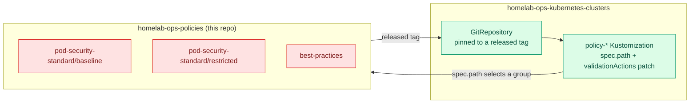
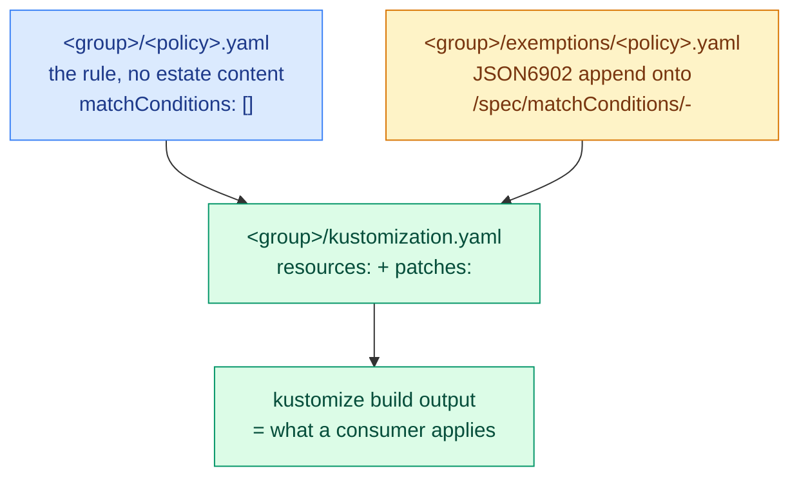

# Design

Why this repository is shaped the way it is: why it exists separately, why the
content is split into three groups and two layers, what the CEL-based policy
kinds forced, how the two test tiers divide the work, and which fidelity deltas
are accepted rather than unnoticed.

For *what* is here — inventory, consumer wiring, release mechanics — see
[README.md](./README.md). For working conventions inside the repo, see
[CLAUDE.md](./CLAUDE.md).

## Why a separate repository

These policies used to live inside `homelab-ops-kubernetes-clusters` alongside
that repo's per-cluster Flux wiring. They are not cluster wiring: the same
policy text applies to every cluster, and nothing about it is decided per
cluster except which group a cluster subscribes to and in what mode it enforces.
Sharing a repo with the wiring made a policy change and a cluster change the
same reviewable unit, shipping on the same reconcile.

Split out, this is one more versioned artifact consumed the way the apps repo's
modules are — a pinned tag, a `GitRepository`, a `Kustomization.spec.path` — so
a policy change is reviewed on its own, released on its own, and rolled out per
cluster by bumping a tag.

## The three groups

**Why both PSS profiles rather than only Restricted.** The estate subscribes to
both — one cluster to Restricted, one to Baseline only. Shipping Restricted
alone would force the softer subscriber to carry a pile of exemptions whose only
purpose is to reconstruct Baseline. Restricted composes Baseline by listing
`../baseline` as a resource rather than by duplicating it, so a Baseline fix
reaches both profiles by construction.

**Why `best-practices` is a group and not a third PSS profile.** It is not a
profile of anything: no external standard to derive from or diff against, no
tiering against the other two, and three of its nine policies do not validate at
all. Folding it into a PSS directory would put content with no reference
implementation into files whose entire value is being diffable against one.

Its exemptions nonetheless use the same Layer-2 patch mechanism as the PSS
groups. An earlier reading had the two-layer split as a consequence of
diffability, and therefore as PSS-only; that was wrong on its own terms. The
separation is worth just as much where the thing being kept clean is a mutation:
`best-practices/exemptions/add-emptydir-sizelimit.yaml` holds an argument about
blast radius that has no business inside the rule it qualifies.

## What the CEL-based kinds forced

Every policy here is `policies.kyverno.io/v1` — `ValidatingPolicy`,
`MutatingPolicy` or `DeletingPolicy`. Three properties of that API shaped
everything below.

**`matchConditions` is a flat, policy-wide, ANDed list.** Every entry states
when the policy applies, so an appended entry can only narrow. That is what
makes an exemption layer possible at all, and it is also a constraint on file
layout — see [One policy per exemption scope](#one-policy-per-exemption-scope).

**CEL compile errors are a failure class the old JMESPath patterns did not
have,** and `kyverno apply` reports one on stdout while exiting in a way that
reads as success. Closing that blind spot was the first change made here, before
any CEL was written; it is why the smoke check asserts on output rather than on
an exit code.

**Autogen is a hazard, not a convenience.** It rewrites `object.` to
`object.spec.template.` throughout a policy *including `matchConditions`*, so a
metadata-based exemption silently stops matching real controller-created Pods.
Every policy of a kind that has the field therefore pins
`spec.autogen.podControllers.controllers: []`, and in Audit mode that costs
close to nothing — the same violation still appears, keyed on the Pod rather
than on its controller.

A measured detail worth keeping, because it is not inferable from the API: at
this engine version a `MutatingPolicy` matching `pods` registers a webhook for
`pods` and nothing else regardless of that field, while a `ValidatingPolicy` on
the same cluster registers all seven pod-controller kinds. Kyverno computes the
mutate rewrite into `status.autogen.configs` and then wires it to nothing. So
`[]` is inert on the mutate kind today and is written anyway: `kyverno test`
*does* simulate the rewrite, so a policy left on the default has the offline tier
asserting a controller mutation the cluster never performs, and an engine
release that later wires those configs up would start mutating every pod
controller in the estate with no commit to attribute it to.

## Faithful mirrors: upstream means Kubernetes, not `kyverno/policies`

The PSS groups mirror the Kubernetes `pod-security-admission` source — the code
the apiserver actually runs — and explicitly not `kyverno/policies`' own port of
it, which this repo found to be a lagging interpreter. The kubernetes.io PSS
documentation page is also stale on several points; the `check_*.go` files are
authoritative. Each mirror carries a `PSS-SNAPSHOT` line naming what it is synced
to, so the next resync has a fixed diff point;
[pod-security-standard/UPSTREAM-SNAPSHOT.md](./pod-security-standard/UPSTREAM-SNAPSHOT.md)
records upstream's check inventory, control definitions, version-skew mechanics
and sources as of that snapshot, and ranks what is most likely to have moved.

Three places where following `kyverno/policies` would have shipped something
wrong:

| Policy | What upstream ships | What this repo ships |
| --- | --- | --- |
| `restrict-volume-types` | Eight volume types, in all three of its variants | Nine — `check_restrictedVolumes.go` added `image`, and it is active at every enforce-version the estate pins |
| `restrict-sysctls` | The five-entry safe list from an older PSS revision | Twelve, as SIG-Node has evaluated them. A short list is an out-of-date copy, not extra margin |
| `restrict-apparmor-profiles` | Deleted from both of its CEL trees | Kept, and checking **both** channels the check file inspects |

The AppArmor case is the exemplar for why the pure layer exists.
`check_appArmorProfile.go` inspects the `securityContext.appArmorProfile` field
*and* the deprecated `container.apparmor.security.beta.kubernetes.io/*`
annotation. This repo's pre-migration policy checked only the annotation, so a
pod setting `appArmorProfile.type: Unconfined` — the way anyone has written it
since the field existed — passed this repo's policy and failed real Pod Security
Admission, quietly, for years. That bug was found by reading the mirror next to
the check file, which is only possible when the mirror has no estate content
mixed into it.

The same rule *adds* content. `disallow-host-probes-and-lifecycle` is
hand-authored because PSS gained the check recently and upstream has no
equivalent in any variant; `disallow-selinux` carries `container_engine_t`;
`disallow-proc-mount`, `require-run-as-nonroot` and `require-run-as-non-root-user`
carry the user-namespace relaxations, paired with `disallow-proc-mount-strict`,
which re-tightens `procMount` at the Restricted tier exactly the way PSS's own
override does.

Outside PSS the same discipline applies against upstream's own rewrites:
`disallow-latest-tag` keeps all three container lists where upstream regressed to
`containers`; `cleanup-empty-replicasets` keeps the 24h age guard that preserves
`kubectl rollout undo`; `add-ndots` keeps an idempotence guard rather than
adopting a version that overrides a workload's own setting.

## Two layers

One file used to hold three complected concerns: the rule, this estate's
exemptions from it, and Kyverno mechanics chosen *because of* those exemptions.
The append seam separates them without introducing runtime machinery, and the
failure mode is the right way round: the worst a malformed append can do is
narrow a policy too far, which a firing fixture catches, rather than silently
widen one. Nothing here is positional, so an append cannot reorder anything
either.

Design choices inside the seam:

- **One mechanism.** Every exemption is a `matchConditions` entry. The single
  exception is `cleanup-empty-replicasets`' `namespaceSelector`, forced by
  `DeletingPolicy` having no such field and justified independently by
  `kube-system` being an exclusion every consumer needs.
- **Every seam-capable policy declares `matchConditions: []`** even with no
  exemptions, so the append path always exists.
- **`PolicyException` was considered and rejected.** It is namespaced — a
  cluster-side placement decision — needs consumer-side Kyverno configuration,
  and inherits the autogen problem rather than solving it.
- **Composability is the payoff.** This repo appends from a group's
  `kustomization.yaml`; a consumer can append byte-identical content from its
  own `Kustomization.spec.patches`. Moving an exemption estate-side later is a
  file move, not a redesign.

One correction worth recording because the original reasoning was falsified by
measurement. Name predicates concatenate `name` and `generateName`, and the
justification is *not* the usual one — that a controller-created Pod reaches
admission with only `generateName`. Measured against a real cluster, the
apiserver generates the name before admission runs, so those Pods arrive
carrying both and a name-only expression would have worked live. The
concatenation is kept because it costs nothing and covers shapes with only one
field present, notably `kyverno test` fixtures, which get no apiserver
defaulting.

### One policy per exemption scope

`matchConditions` is policy-wide, so a policy whose rules need *different*
exclusion sets cannot express them at the seam without pushing exemptions back
inside validation expressions and re-complecting the layers. Two PSS checks are
therefore more than one file each:

| PSS check | Files here | Why |
| --- | --- | --- |
| `hostNamespaces` | `disallow-host-network`, `disallow-host-pid`, `disallow-host-ipc` | Three different exclusion sets; `hostIPC` needs none |
| `capabilities_restricted` | `require-drop-all`, `disallow-capabilities-strict` | Only the drop-`ALL` half is exempted; joining them would silently widen that exemption to the add-check |

The cost is five PolicyReport policy names where PSS reports two checks. Nothing
consumes those names programmatically. PSS's own check granularity is about its
internal bookkeeping, not a constraint on how a mirror lays out files — fidelity
means semantics, not file count.

## Two test tiers

Silently-wrong hand-translated CEL was the dominant risk of building this tree,
so the tiers were built before the translation rather than after it.

| Concern | `kyverno test` (offline) | Chainsaw (kind cluster) |
| --- | --- | --- |
| Validation and mutation rule semantics | **owns** | spot-checks via good/bad pairs |
| Exemption expressions, including `generateName`-only shapes | **owns** | — |
| An exemption firing for a real controller-created Pod | — | **owns** |
| Policy readiness (webhook configured, RBAC granted) | cannot see it | **owns** |
| Behaviour under `[Deny]` | approximates via outcomes | **owns** (in-test patch; shipped authoring stays `[Audit]`) |
| Mutations landing on live objects | approximates | **owns** |
| `DeletingPolicy` schedules firing + cleanup-controller RBAC | cannot see it | **owns** |
| `cleanup-empty-replicasets`' 24h age discrimination | **owns** — a fixture can declare `creationTimestamp` | **cannot** — it is server-set, so a live test can only assert the negative |

The dividing rule: a Chainsaw test exists only where a live cluster adds
information the offline tier cannot produce. A policy with no Chainsaw directory
is covered by the CLI tier plus its profile's `ready-smoke`, which applies the
whole built stream and asserts every policy reaches Ready — the cheapest
cluster-level catch for engine-level rejects across a profile at once.

Both tiers run against `kustomize build` output. Testing only pure files would
leave the exemption layer untested; testing only built output would blur which
layer broke. So an exemption-carrying policy gets two `Test` documents over the
same fixtures, and every exemption's firing fixture is asserted `skip` against
the built policy and `fail` (or, for a mutate policy, `pass`) against the pure
one. A patch whose `target:` is mistyped is a silent kustomize no-op; that
paired assertion is the only thing that catches it.

One limit shaped what could be proven: the offline tier **cannot assert that a
resource went unmatched**. No selector variant expresses it and unasserted extras
pass silently. This mattered for `require-probes`, which now matches the three
controller kinds rather than Pods: that it genuinely stopped touching bare Pods
is not a claim this tier can carry, and its file records the accepted scope
instead.

Two properties of the harness are enforced rather than trusted, because both
tiers can otherwise report green while measuring the wrong thing:

- **The Chainsaw cluster installs Kyverno with the estate's own
  `resourceFiltersExclude`.** The chart's defaults hide ReplicaSets from every
  engine, so a stock install makes `cleanup-empty-replicasets` unobservable —
  and a test asserting a ReplicaSet survived would pass for the wrong reason.
- **`ci/scripts/audit-test-fixtures.sh` gates the offline tier on its fixture
  identities resolving.** `kyverno test` treats a duplicated
  apiVersion+kind+namespace+name as a resource to drop, and an unresolved
  `results[].resources` selector as no selector at all. The first shrinks
  coverage, the second broadens a single row over everything loaded; neither is
  an error to the CLI.

## The regression tally

Rewriting every exemption from `exclude:` blocks into CEL carries one risk that
no fixture can catch: an exemption quietly **dropped**, because a fixture for a
missing exemption is also missing. The tally is the check for that class —
enumerate every exclusion in the pre-migration content, count it two ways, and
require the current tree to account for each one. A lower count is a bug. A
higher count needs a reason.

Method: parse the pre-migration `ClusterPolicy`/`ClusterCleanupPolicy`
`exclude:` blocks out of git, parse the current `exemptions/` patch documents
plus the one inline exclusion, and count *occurrences* — a workload glob named in
one exclusion item counts once, wherever it appears.

| Measure | Pre-migration | Now | |
| --- | --- | --- | --- |
| Distinct workload name-globs | 8 | 8 | unchanged |
| Total name-glob occurrences | 27 | 27 | unchanged |
| Blanket namespace-exclusion items | 9 | 11 | +2, two deliberate splits |
| Distinct namespace values | 7 | 7 | unchanged |
| Exemption-bearing policies | — | 16 | 37 patch entries in 16 files |

The name-globs, with occurrence counts identical on both sides:

| Glob | × |
| --- | --- |
| `virt-handler` | 10 |
| `kube-prometheus-stack-prometheus-node-exporter` | 4 |
| `virt-launcher` | 4 |
| `alloy` | 2 |
| `intel-gpu-plugin-gpu-device` | 2 |
| `metallb-speaker` | 2 |
| `node-problem-detector` | 2 |
| `cert-manager-cainjector` | 1 |

The seven namespace values are `csi-driver-nfs`, `dns`, `kube-system`,
`longhorn-system`, `metallb-system`, `system-upgrade` and `tailscale`. Every
other namespace appearing in an exemption — `kubevirt`, `monitoring`, `logging`,
`cert-manager`, `intel-device-plugins`, `sandbox-docker`, `sandbox-talos` — is
only ever half of a name-plus-namespace predicate, never a blanket exclusion.

**The two extra blanket items are splits, not additions.** Both took one
multi-namespace list and gave each rationale its own named entry, with identical
resulting scope:

- The `hostNamespaces` split moved `[csi-driver-nfs, metallb-system]` onto
  `disallow-host-network`, where the two namespaces are excused for visibly
  different reasons (in-kernel NFS client mounts; BGP from the node's own
  addresses).
- `add-ndots` separated `dns` from the infrastructure namespaces: the cluster DNS
  servers are exempt because the optimisation is circular for them, not because
  their manifests are somebody else's.

**Counts alone would still permit an exemption that is present but inert**, so
the tally is paired with a mechanical check that every exemption *member* — each
glob, and each namespace inside an `in [...]` list — has a firing fixture
asserted in both directions. Re-running that check is what produced this
document's one substantive change: `disallow-capabilities`' five-namespace list
had a single fixture standing in for the set, so four of its five members could
have been deleted with the suite still green. It now has one apiece, matching
`disallow-host-path` and `disallow-privileged-containers`.

Both checks are mechanically re-derivable from the tree at any time, which is
what makes them worth keeping rather than treating as migration scaffolding. Any
future change that restructures exemptions — relocating them consumer-side, for
instance — should re-run both against the numbers above.

## Accepted deltas

Two known gaps are deliberate, documented in the relevant policy files, and
pinned by fixtures that go red if anyone closes them silently.

**`disallow-host-probes-and-lifecycle` ships with no exemption and will produce
Audit rows.** Four `hostNetwork: true` workloads pin a probe to loopback —
csi-driver-nfs's controller and node charts, metallb's `speaker` and `frr-k8s` —
which is the benign end of this control's range. PSS makes no such distinction:
`getForbiddenHostProbes()` tests `Host != ""` and nothing more, and a faithful
mirror must not invent a loopback carve-out. Under Audit the faithfulness costs
accurate rows saying those pods deviate from PSS Baseline, which they do.
Quietening the stream would take an exemption patch carrying its own rationale;
that is a decision, not a default.

**The PSS Windows disjunct sits on only one half of the capabilities split.**
PSS exempts `spec.os.name == "windows"` pods from the whole
`capabilities_restricted` check; `disallow-capabilities-strict` carries that
disjunct and `require-drop-all` does not. The delta is inert on this estate — no
Windows nodes, nothing sets `spec.os.name` — and costs at most one Audit row on
a hypothetical Windows pod omitting `drop: [ALL]`. Closing it means adding the
disjunct to `require-drop-all`, never deleting it from the sibling.

## CI and validation

| Workflow | Trigger | What it does |
| --- | --- | --- |
| `lint.yaml` | every PR, weekly | Style, formatting and manifest-schema checks; most jobs gated on changed paths |
| `policy-smoke-check.yaml` | policy/build-script changes, weekly | Every policy, pure and built, against one unremarkable Pod: parses, passes Kyverno's CRD schema, compiles its CEL. Deliberately says nothing about behaviour |
| `policy-cli-tests.yaml` | policy/CLI-test/`ci/scripts` changes, weekly | The fixture audit, then the offline tier |
| `e2e-tests.yaml` | policy or `ci/` changes, weekly | kind cluster on the estate's pinned Kubernetes minor, Kyverno from the estate's pinned chart, then `chainsaw test` |
| `release.yaml` | pushes to `main` touching policy content or release state | release-please |
| `renovate.yaml` | daily | Dependency-update PRs |

**One workflow per concern.** These could have been jobs in one bundled file.
They are separate because they have different triggers, different runtimes and
different failure meanings — a red check should name what broke without anyone
opening the workflow.

**The smoke check never trusts an exit code.** A policy that fails Kyverno's CRD
schema is silently *dropped* by `kyverno apply` rather than rejected: it still
prints its "Applying N policy rule(s)" line and exits 0. Meanwhile a legitimate
policy failing a rule against an arbitrary resource exits non-zero for entirely
uninteresting reasons. The job asserts on the reported rule count and on the
absence of any `^Error:` line instead. That second signal is the CEL-compile
blind spot.

**Version lockstep.** The Kyverno CLI version used by the two offline workflows,
the Kyverno chart version installed by `e2e-tests.yaml`, and the kind node
image's Kubernetes minor are pinned together to what the estate runs, each with
a Renovate comment saying so. The intent is to test this engine on this
Kubernetes, not compatibility breadth.
