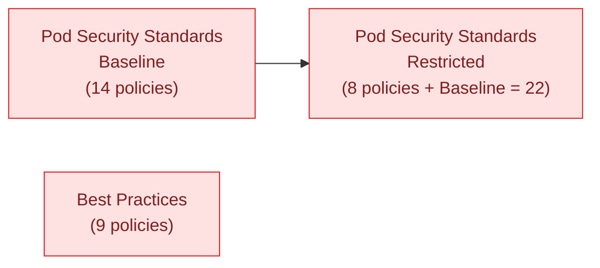

# homelab-ops-policies

Cluster-agnostic [Kyverno](https://kyverno.io/) policy definitions. This repo
holds policy content only — no Flux wiring, no cluster-specific configuration,
no awareness of what's consuming it. It's released independently and referenced
by tag from wherever it's applied, the same way
[`homelab-ops-kubernetes-apps`](https://github.com/ppat/homelab-ops-kubernetes-apps)
modules are referenced from the cluster-wiring repo.

For *why* the repo is shaped the way it is — the layering, the kind migration,
the test tiers, the open decisions — see [DESIGN.md](./DESIGN.md).

## Policy kinds

Every policy here is one of Kyverno's CEL-based `policies.kyverno.io/v1` kinds.
The older `kyverno.io/v1 ClusterPolicy` and `kyverno.io/v2beta1
ClusterCleanupPolicy` kinds this repo started on are deprecated since Kyverno
v1.17 and are removed in v1.20; nothing in this repo uses them any more.

| Kind | What it does | Count |
| --- | --- | --- |
| `ValidatingPolicy` | Reports (or blocks) resources that violate a rule | 26 |
| `MutatingPolicy` | Patches resources on admission | 3 |
| `DeletingPolicy` | Deletes matching resources on a schedule | 2 |

Validation logic is CEL (`spec.validations[].expression`) rather than
JMESPath patterns, matching is VAP-shaped
(`spec.matchConstraints.resourceRules[]`), and enforcement mode is
`spec.validationActions` rather than `spec.validationFailureAction`. Every
`ValidatingPolicy` here ships `[Audit]`; see
[Consuming this repo](#consuming-this-repo) for how a consumer changes that.

## Groups

| Group | Path | What it is |
| --- | --- | --- |
| Pod Security Standards — Baseline | [`pod-security-standard/baseline`](./pod-security-standard/baseline) | Minimally restrictive PSS profile |
| Pod Security Standards — Restricted | [`pod-security-standard/restricted`](./pod-security-standard/restricted) | Hardened PSS profile; extends Baseline (its `kustomization.yaml` lists `../baseline` as a resource) |
| Best Practices | [`best-practices`](./best-practices) | Validate/Mutate/Delete policies unrelated to Pod Security Standards |

Baseline and Restricted are both provided, rather than shipping Restricted
alone, because the two profiles are meaningfully different in strictness and
not every consumer wants the stricter one — a consumer picks whichever profile
fits by pointing at that directory (Restricted pulls in Baseline automatically
via its `kustomization.yaml`).



## Pod Security Standards

Faithful mirrors of the [Kubernetes Pod Security
Standards](https://kubernetes.io/docs/concepts/security/pod-security-standards/)
as implemented by the apiserver's own `pod-security-admission` package —
snapshotted at Kubernetes 1.36 / PSS policy version v1.35, which every mirror
file records in a `PSS-SNAPSHOT` marker at the top. The mirrors carry no
estate-specific content at all; exemptions are a separate layer (see
[Exemptions](#exemptions)).

### Baseline

| Policy | What it disallows/requires |
| --- | --- |
| `disallow-capabilities` | Capabilities beyond a default-safe set |
| `disallow-host-ipc` | `hostIPC` |
| `disallow-host-network` | `hostNetwork` |
| `disallow-host-path` | `hostPath` volumes |
| `disallow-host-pid` | `hostPID` |
| `disallow-host-ports` | `hostPort` |
| `disallow-host-probes-and-lifecycle` | A non-empty `.host` on any probe or lifecycle hook |
| `disallow-host-process` | Windows HostProcess containers |
| `disallow-privileged-containers` | `privileged: true` |
| `disallow-proc-mount` | Non-default `procMount` (skipped for user-namespaced pods) |
| `disallow-selinux` | A `seLinuxOptions.type` outside the allowed list, or any `user`/`role` |
| `restrict-apparmor-profiles` | Opting out of AppArmor confinement, via either the field or the deprecated annotation |
| `restrict-seccomp` | `seccompProfile: Unconfined` |
| `restrict-sysctls` | Sysctls outside PSS's 12-entry safe list |

Two of these are new relative to the pre-migration content:

- **`disallow-host-probes-and-lifecycle`** mirrors the `hostProbesAndHostLifecycle`
  check PSS Baseline gained at policy version v1.34. It has no upstream
  `kyverno/policies` equivalent in any variant and was hand-authored from the
  Kubernetes source. The kubelet performs probe and lifecycle-hook calls from
  the node, so a `.host` turns a pod spec into a kubelet-sourced request
  primitive reaching anything the node reaches.
- **`disallow-host-network`**, **`disallow-host-pid`** and **`disallow-host-ipc`**
  replace the single `disallow-host-namespaces` policy. It carried three rules
  with three different exclusion sets, and the new kinds' exemption seam is
  policy-wide — see [DESIGN.md](./DESIGN.md#one-policy-per-exemption-scope).

### Restricted

Restricted adds on top of all of the above:

| Policy | What it disallows/requires |
| --- | --- |
| `disallow-capabilities-strict` | Adding any capability except `NET_BIND_SERVICE` |
| `disallow-privilege-escalation` | `allowPrivilegeEscalation: true` |
| `disallow-proc-mount-strict` | Non-default `procMount`, unconditionally (including for user-namespaced pods) |
| `require-drop-all` | Every container must `drop: [ALL]` |
| `require-run-as-non-root-user` | `runAsUser: 0` (skipped for user-namespaced pods) |
| `require-run-as-nonroot` | `runAsNonRoot` unset or false (skipped for user-namespaced pods) |
| `restrict-seccomp-strict` | A missing seccomp profile, not just `Unconfined` |
| `restrict-volume-types` | Volume types beyond PSS's nine-type allow-list |

Also new or reshaped here:

- **`require-drop-all`** and **`disallow-capabilities-strict`** are the two
  halves of what used to be a single two-rule `disallow-capabilities-strict`
  policy, split for the same reason the host-namespaces policy was.
- **`disallow-proc-mount-strict`** mirrors PSS's `procMount_restricted` check,
  added at policy version v1.35, which re-tightens what Baseline's
  `disallow-proc-mount` now relaxes for pods running in a user namespace. Read
  the two as a matched pair.

## Best Practices

Mixes validation, mutation, and scheduled deletion. These are not mirrors of an
external standard, so unlike the PSS policies they keep their exemptions inline.

| Policy | Kind | What it does |
| --- | --- | --- |
| `add-default-resources` | `MutatingPolicy` | Adds default CPU/memory requests to containers missing them |
| `add-emptydir-sizelimit` | `MutatingPolicy` | Adds a `sizeLimit` to `emptyDir` volumes missing one |
| `add-ndots` | `MutatingPolicy` | Sets DNS `ndots: 1` on Pods, avoiding an extra DNS lookup per query |
| `cleanup-bare-pods` | `DeletingPolicy` | Deletes unowned (controller-less) Pods on a daily schedule |
| `cleanup-empty-replicasets` | `DeletingPolicy` | Deletes empty `ReplicaSet`s older than 24h, hourly |
| `disallow-cri-sock-mount` | `ValidatingPolicy` | Blocks mounting the container runtime socket |
| `disallow-latest-tag` | `ValidatingPolicy` | Requires an explicit, non-`latest` image tag |
| `require-probes` | `ValidatingPolicy` | Requires a liveness, readiness, or startup probe on every container |
| `restrict-node-port` | `ValidatingPolicy` | Blocks `Service` type `NodePort` |

`require-probes` matches Deployments, DaemonSets and StatefulSets directly
rather than Pods — its rule is genuinely controller-shaped, and matching
controllers removes the need for autogen and for a "skip Job-owned pods"
precondition.

## Exemptions

Some workloads legitimately need the behaviour a policy otherwise disallows.
Where those exemptions live depends on the group:

- **Pod Security Standards.** The policy file is a pure mirror with
  `matchConditions: []` — an empty seam. Each estate exemption is a JSON6902
  patch document under `pod-security-standard/<profile>/exemptions/<policy>.yaml`,
  attached by a `patches:` entry in that profile's `kustomization.yaml`, each
  entry appending to `/spec/matchConditions/-`. A policy with no exemptions has
  no file there and no entry.
- **Best Practices.** Exemptions stay inline in the policy's own
  `spec.matchConditions`. The purity property only pays where there is an
  external standard to diff the file against, and these policies have none.

The split exists so a PSS mirror can be read line-by-line next to the
Kubernetes check it mirrors with no estate content in the way. `matchConditions`
entries are ANDed and state when a policy *should* apply, so every exemption is
written as a negation and appending one can only ever narrow a policy — never
weaken what it validates. [DESIGN.md](./DESIGN.md#the-exemption-patch-seam) has
the full reasoning.

What ships is therefore the `kustomize build` output of a group directory, not
any single file — a policy and its exemption patch are two files, and a patch
file on its own is not valid Kyverno YAML.

## Consuming this repo

This repo produces no running system by itself — it's a source of policy
manifests for something else to apply. A consumer pins a released tag via a
Flux `GitRepository` and points a `Kustomization.spec.path` at one of the group
directories above, the same shape used to pull in a versioned module from
`homelab-ops-kubernetes-apps`:

```yaml
apiVersion: source.toolkit.fluxcd.io/v1
kind: GitRepository
metadata:
  name: policy-best-practices
  namespace: flux-system
spec:
  interval: 1h
  ref:
    tag: v0.0.1 # x-release-please-version
  url: https://github.com/ppat/homelab-ops-policies.git
---
apiVersion: kustomize.toolkit.fluxcd.io/v1
kind: Kustomization
metadata:
  name: policy-best-practices
  namespace: flux-system
spec:
  interval: 1h
  path: ./best-practices
  prune: true
  sourceRef:
    kind: GitRepository
    name: policy-best-practices
    namespace: flux-system
```

Every `ValidatingPolicy` here ships `spec.validationActions: [Audit]`
(`MutatingPolicy` and `DeletingPolicy` have no such field) — this repo doesn't
know whether a given consumer wants violations to just report, warn at apply
time, or block admission. A consumer that wants a different mode overrides it
with a patch on its own `Kustomization`, rather than this repo forking policy
content per desired mode:

```yaml
spec:
  patches:
  - patch: |-
      - op: replace
        path: /spec/validationActions
        value: [Deny]
    target:
      kind: ValidatingPolicy
```

Note this is a change from the pre-migration shape, which targeted
`kind: ClusterPolicy` and `/spec/validationFailureAction`. A consumer moving to
a tag that contains the migrated kinds must change its patch in the same
change — a patch whose `target:` matches nothing is a silent no-op, not an
error.

## Testing

Two tiers, both under `ci/`, neither shipped to consumers:

- **`kyverno test` (offline).** `cli.kyverno.io/v1alpha1 Test` files under
  `ci/policy-tests/kyverno/`, mirroring the policy tree by profile and policy
  name. Owns rule semantics and exemption expressions, asserted per resource
  with pass/fail/skip distinguished. Every policy has a suite here.
- **Chainsaw (live cluster).** Tests under `ci/policy-tests/chainsaw/`, run
  against a kind cluster on the estate's pinned Kubernetes minor with the
  estate's pinned Kyverno chart. Reserved for what only a cluster can prove:
  policy readiness against the real webhook, actual rejection under `[Deny]`,
  mutations landing on live objects, `DeletingPolicy` schedules firing, and an
  exemption firing for a controller-created pod arriving through real admission.

Both tiers run against the `kustomize build` output of each group directory
(`ci/scripts/build-policies.sh`), never a policy file in isolation. See
[CLAUDE.md](./CLAUDE.md#testing) for the working conventions and
[DESIGN.md](./DESIGN.md#test-architecture-two-tiers) for why the tiers are
divided the way they are.

## Versioning and releases

Releases are cut with [release-please](https://github.com/googleapis/release-please)
from [Conventional Commits](https://www.conventionalcommits.org/), enforced
on every PR via commitlint (`commitlint.config.js` is the source of truth for
allowed commit types/scopes). Merging to `main` accumulates a release PR;
merging that PR tags and publishes the next version for consumers to pin.
The example tag above is kept in sync automatically: release-please rewrites
any `# x-release-please-version` marker in this file to the latest released
tag as part of cutting a release.
