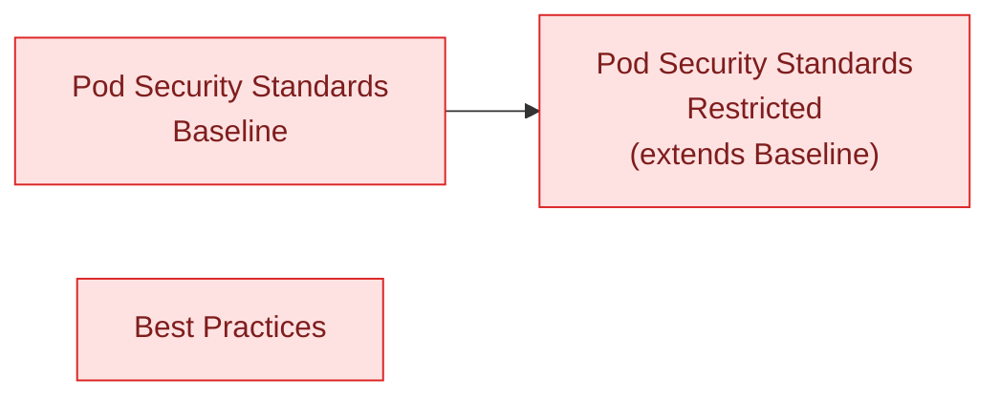

# homelab-ops-policies

Cluster-agnostic [Kyverno](https://kyverno.io/) policy definitions. This repo
holds policy content only — no Flux wiring, no
cluster-specific configuration, no awareness of what's consuming it. It's
released independently and referenced by tag from wherever it's applied,
the same way [`homelab-ops-kubernetes-apps`](https://github.com/ppat/homelab-ops-kubernetes-apps)
modules are referenced from the cluster-wiring repo.

> **Migration in progress.** Kyverno's `ClusterPolicy` and
> `ClusterCleanupPolicy` kinds are deprecated and are being replaced here by
> the CEL-based `policies.kyverno.io/v1` kinds (`ValidatingPolicy`,
> `MutatingPolicy`, `DeletingPolicy`). The port is happening policy by policy,
> so both kinds are present in the tree today, and the sections below still
> describe the legacy shape in places — most importantly the consumer patch
> under "Consuming this repo", which targets `kind: ClusterPolicy` and
> silently matches nothing once a policy has been ported. A consumer pinning a
> released tag is unaffected until it moves to a tag containing ported
> policies; that cutover is a coordinated change on both sides. This notice
> and the text it qualifies are rewritten once the migration completes.
>
> Two policies are ported so far and are the house-style references for the
> rest: `best-practices/restrict-node-port.yaml` and
> `pod-security-standard/restricted/restrict-volume-types.yaml`. The ported
> Pod Security Standards policies are exemption-free mirrors of the upstream
> standard; the estate-specific exemptions they used to carry inline now live
> beside them as kustomize patches in
> `pod-security-standard/<profile>/exemptions/`, which build into the same
> shipped result.

## Groups

| Group | Path | What it is |
| --- | --- | --- |
| Pod Security Standards — Baseline | [`pod-security-standard/baseline`](./pod-security-standard/baseline) | Minimally restrictive PSS profile |
| Pod Security Standards — Restricted | [`pod-security-standard/restricted`](./pod-security-standard/restricted) | Hardened PSS profile; extends Baseline (its `kustomization.yaml` lists `../baseline` as a resource) |
| Best Practices | [`best-practices`](./best-practices) | Validate/Mutate/Cleanup policies unrelated to Pod Security Standards |

Baseline and Restricted are both provided, rather than shipping Restricted
alone, because the two profiles are meaningfully different in strictness and
not every consumer wants the stricter one — a consumer picks whichever
profile fits by pointing at that directory (Restricted pulls in Baseline
automatically via its `kustomization.yaml`).



## Pod Security Standards

Ports the upstream [Kubernetes Pod Security Standards](https://kubernetes.io/docs/concepts/security/pod-security-standards/)
to Kyverno `ClusterPolicy` validation rules.

| Policy | What it disallows/requires |
| --- | --- |
| `disallow-capabilities` | Capabilities beyond a default-safe set |
| `disallow-host-namespaces` | Host PID/IPC/network namespaces |
| `disallow-host-path` | `hostPath` volumes |
| `disallow-host-ports` | `hostPort` |
| `disallow-host-process` | Windows HostProcess containers |
| `disallow-privileged-containers` | `privileged: true` |
| `disallow-proc-mount` | Non-default `procMount` |
| `disallow-selinux` | Custom `seLinuxOptions` |
| `restrict-apparmor-profiles` | Non-default AppArmor profiles |
| `restrict-seccomp` | `seccompProfile: Unconfined` |
| `restrict-sysctls` | Unsafe sysctls |

Restricted adds on top of all of the above:

| Policy | What it disallows/requires |
| --- | --- |
| `disallow-capabilities-strict` | Any capability except `NET_BIND_SERVICE` |
| `disallow-privilege-escalation` | `allowPrivilegeEscalation: true` |
| `require-run-as-non-root-user` | `runAsUser` unset or 0 |
| `require-run-as-nonroot` | `runAsNonRoot` unset/false |
| `restrict-seccomp-strict` | Missing seccomp profile (not just `Unconfined`) |
| `restrict-volume-types` | Volume types beyond a safe allow-list |

## Best Practices

Mixes validation, mutation, and scheduled cleanup:

| Policy | Type | What it does |
| --- | --- | --- |
| `add-default-resources` | Mutate | Adds default CPU/memory requests to containers missing them |
| `add-emptydir-sizelimit` | Mutate | Adds a `sizeLimit` to `emptyDir` volumes missing one |
| `add-ndots` | Mutate | Sets DNS `ndots: 1` on Pods, avoiding an extra DNS lookup per query |
| `disallow-cri-sock-mount` | Validate | Blocks mounting the container runtime socket |
| `disallow-latest-tag` | Validate | Requires an explicit, non-`latest` image tag |
| `require-probes` | Validate | Requires a liveness, readiness, or startup probe on every container |
| `restrict-node-port` | Validate | Blocks `Service` type `NodePort` |
| `cleanup-bare-pods` | Cleanup | Deletes unowned (controller-less) Pods on a daily schedule |
| `cleanup-empty-replicasets` | Cleanup | Deletes empty `ReplicaSet`s on a recurring schedule |

Each policy excludes the system namespaces and workloads that legitimately
need the behavior it otherwise disallows (e.g. `require-probes` doesn't apply
to a handful of infra DaemonSets that have none) — the exact exclusion list
is a policy-tuning detail that lives in, and should be read from, each
policy's own `exclude` block rather than restated here.

## Consuming this repo

This repo produces no running system by itself — it's a source of policy
manifests for something else to apply. A consumer pins a released tag via a
Flux `GitRepository` and points a `Kustomization.spec.path` at one of the
group directories above, the same shape used to pull in a versioned module
from `homelab-ops-kubernetes-apps`:

```yaml
apiVersion: source.toolkit.fluxcd.io/v1
kind: GitRepository
metadata:
  name: policy-best-practices
  namespace: flux-system
spec:
  interval: 1h
  ref:
    tag: v0.0.1 # x-release-please-version
  url: https://github.com/ppat/homelab-ops-policies.git
---
apiVersion: kustomize.toolkit.fluxcd.io/v1
kind: Kustomization
metadata:
  name: policy-best-practices
  namespace: flux-system
spec:
  interval: 1h
  path: ./best-practices
  prune: true
  sourceRef:
    kind: GitRepository
    name: policy-best-practices
    namespace: flux-system
```

Every `Validate`-type policy here ships with whatever `validationFailureAction`
its manifest sets (`Mutate` rules and `ClusterCleanupPolicy` don't have this
field) — this repo doesn't know whether a given consumer wants violations to
just report (`Audit`) or actually block admission (`Enforce`). A consumer
that wants a different mode overrides it with a patch on its own
`Kustomization`, targeting `kind: ClusterPolicy`, rather than this repo
forking policy content per desired mode.

## Versioning and releases

Releases are cut with [release-please](https://github.com/googleapis/release-please)
from [Conventional Commits](https://www.conventionalcommits.org/), enforced
on every PR via commitlint (`commitlint.config.js` is the source of truth for
allowed commit types/scopes). Merging to `main` accumulates a release PR;
merging that PR tags and publishes the next version for consumers to pin.
The example tag above is kept in sync automatically: release-please rewrites
any `# x-release-please-version` marker in this file to the latest released
tag as part of cutting a release.
