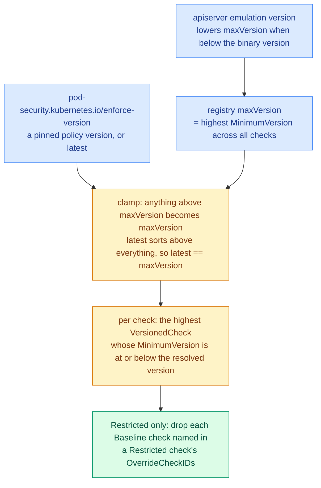

# Pod Security Standards upstream — snapshot at Kubernetes 1.36

> **This is a dated research record, not a live description of upstream.**
> Every statement below was verified against the `release-1.36` branch of
> `kubernetes/kubernetes`, at a point when v1.36.4 was the newest patch and
> v1.37.0-rc.1 existed but was not GA. It will go out of date with each
> Kubernetes minor release, and that is the point: it records what was known the
> last time the mirrors in `baseline/` and `restricted/` were aligned to
> upstream, so the next alignment pass starts from a fixed diff point instead of
> from scratch.

Read it as *what upstream looked like then, and where we looked to find out*.
Every claim carries its source so it can be re-read at whatever version is
current when you need it. How this repository implements any of this is not in
scope here — see [../DESIGN.md](../DESIGN.md).

Headline of the snapshot: Baseline and Restricted had both changed materially
since the 1.22–1.25 era — two new check files, one new Baseline control, a
Restricted volume type added, six new safe sysctls, a new SELinux type, an
AppArmor field-based check, and, structurally the largest, user-namespace
conditional relaxations that landed unconditionally at policy version v1.35.

## Where to look

| Artifact | Location |
| --- | --- |
| Check implementations | `staging/src/k8s.io/pod-security-admission/policy/check_<id>.go` in `kubernetes/kubernetes` |
| Directory listing used for the inventory | `https://api.github.com/repos/kubernetes/kubernetes/contents/staging/src/k8s.io/pod-security-admission/policy?ref=release-1.36` |
| A single check file, raw | `https://raw.githubusercontent.com/kubernetes/kubernetes/release-1.36/staging/src/k8s.io/pod-security-admission/policy/check_restrictedVolumes.go` |
| Version resolution | `.../pod-security-admission/policy/registry.go`, `.../pod-security-admission/api/helpers.go` |
| Container traversal | `.../pod-security-admission/policy/visitor.go` |
| User-namespace helper | `.../pod-security-admission/policy/helpers.go` |
| Admission plumbing | `plugin/pkg/admission/security/podsecurity/admission.go` |
| Feature gates | `pkg/features/kube_features.go` |
| Published documentation | `https://raw.githubusercontent.com/kubernetes/website/main/content/en/docs/concepts/security/pod-security-standards.md` |

Unqualified `check_*.go`, `registry.go`, `visitor.go` and `helpers.go`
references below are relative to the policy directory in row 1. Line numbers are
as of `release-1.36` and are the first thing that will drift.

## How the standards are defined

The standards are a registry of checks, not a document. Each `check_<id>.go`
declares a check ID, a level (`Baseline` or `Restricted`), one or more
`VersionedCheck` entries each with a `MinimumVersion`, and optionally
`OverrideCheckIDs` — Baseline check IDs it replaces when Restricted is in force.
Restricted is every Baseline check, minus the overridden ones, plus the
Restricted checks.

Resolution mechanics, from `registry.go`:

- `populate()` computes `r.maxVersion` — the highest `MinimumVersion` across all
  registered checks.
- `inflateVersions()` expands each check's versions so every minor from v1.0 to
  `maxVersion+1` maps to exactly one `CheckPodFn` per check.
- `EvaluatePod()` clamps down: `if r.maxVersion.Older(lv.Version) { lv.Version = r.maxVersion }`.
- `api/helpers.go:44-49` — `Older()` treats `latest` as newer than everything
  ("Latest is always consider newer, even than future versions").



Two consequences that the profile definitions do not show:

- **`latest` resolves to the registry's `maxVersion`, never to the apiserver's
  minor.** On a 1.36 apiserver `latest` was policy version **v1.35**, not v1.36,
  because the newest registered revisions were `procMount` 1.35,
  `procMount_restricted` 1.35, `runAsNonRoot` 1.35 and `runAsUser` 1.35. On 1.37
  it resolves to v1.37, because `sysctls` gains a 1.37 revision.
- **Emulation lowers it.** `NewEvaluator(checks, emulationVersion)` — plumbing
  added by PR #133176 (v1.34) and PR #133178 (v1.35), wired at
  `plugin/pkg/admission/security/podsecurity/admission.go:153,164-168` — lowers
  `maxVersion` when the apiserver runs an emulated version below its binary
  version. A 1.36 binary emulating 1.33 resolves `latest` to v1.33, and none of
  the 1.35 behaviours apply.

## Check inventory at 1.36

| Check ID | Level | `MinimumVersion`s registered | Overrides |
| --- | --- | --- | --- |
| `hostNamespaces` | Baseline | 1.0 | — |
| `privileged` | Baseline | 1.0 | — |
| `capabilities_baseline` | Baseline | 1.0 | — |
| `hostPathVolumes` | Baseline | 1.0 | — |
| `hostPorts` | Baseline | 1.0 | — |
| `appArmorProfile` | Baseline | 1.0 | — |
| `seLinuxOptions` | Baseline | 1.0, 1.31 | — |
| `procMount` | Baseline | 1.0, 1.35 | — |
| `seccompProfile_baseline` | Baseline | 1.0, 1.19 | — |
| `sysctls` | Baseline | 1.0, 1.27, 1.29, 1.32 | — |
| `windowsHostProcess` | Baseline | 1.0 | — |
| `hostProbesAndHostLifecycle` | Baseline | 1.34 (new) | — |
| `restrictedVolumes` | Restricted | 1.0 | `hostPathVolumes` |
| `allowPrivilegeEscalation` | Restricted | 1.8, 1.25 | — |
| `runAsNonRoot` | Restricted | 1.0, 1.35 | — |
| `runAsUser` | Restricted | 1.23, 1.35 | — |
| `seccompProfile_restricted` | Restricted | 1.19, 1.25 | `seccompProfile_baseline` |
| `capabilities_restricted` | Restricted | 1.22, 1.25 | `capabilities_baseline` |
| `procMount_restricted` | Restricted | 1.35 (new) | `procMount` |

Diffing the `release-1.25` and `release-1.36` file lists, only three files are
structurally new or renamed; everything else in `check_*.go` is a 1.22-era file
amended in place:

- `check_hostProbesAndhostLifecycle.go` — new, PR #125271, commit `333b19b44`,
  milestone v1.34.
- `check_procMount_restricted.go` — new, PR #132157, commit `e8bd3f629`,
  milestone v1.35.
- `check_procMount.go` renamed to `check_procMount_baseline.go` in that same
  v1.35 PR.

`release-1.37` has an identical file list to `release-1.36` — no new checks in
1.37.

## Baseline controls at 1.36

The classic list is fully intact — nothing was removed.

| Control | Inspected | Accepted |
| --- | --- | --- |
| Host namespaces | `hostNetwork`, `hostPID`, `hostIPC` | undefined or `false` |
| Privileged | `securityContext.privileged` | undefined or `false` |
| Capabilities | `capabilities.add` | Subset of the [Baseline add allow-list](#baseline-capability-add-allow-list) |
| hostPath volumes | `volumes[].hostPath` | absent |
| Host ports | `ports[].hostPort` on every container, init container and ephemeral container (`check_hostPorts.go`, one `VersionedCheck` at 1.0) | undefined or `0`. An outright ban — no range-based nuance exists anywhere in the standard or the code |
| AppArmor | Both the field and the annotation — see [AppArmor: two channels](#apparmor-two-channels-both-live) | `RuntimeDefault`, `Localhost` |
| SELinux | `seLinuxOptions.type` (`check_seLinuxOptions.go:96-99`) | The [version-dependent type set](#selinux-type-allow-list). `.user` and `.role` must be empty at every version |
| `/proc` mount type | `securityContext.procMount` | `Default` or undefined, with a v1.35 relaxation — see [User namespaces](#user-namespaces-are-a-relaxation-trigger-not-a-restricted-field) |
| Seccomp | Annotations for policy below 1.19, the field from 1.19 | `RuntimeDefault`, `Localhost`, undefined |
| Sysctls | `podSpec.SecurityContext.Sysctls` **only** — pod level is the only place the API allows them (`check_sysctls.go:85-106`) | The [safe list](#sysctl-safe-list) |
| HostProcess | `windowsOptions.hostProcess` | undefined or `false` |
| Host probes and lifecycle hooks | see below | `""` or undefined |

**Host probes and lifecycle hooks** is the one genuinely new Baseline control
since 1.25. `check_hostProbesAndhostLifecycle.go`, check ID
`hostProbesAndHostLifecycle`, `MinimumVersion: api.MajorMinorVersion(1, 34)`. It
forbids a non-empty `.host` on:

- `livenessProbe` / `readinessProbe` / `startupProbe` × `httpGet.host` /
  `tcpSocket.host`
- `lifecycle.postStart` / `preStop` × `httpGet.host` / `tcpSocket.host`

for all containers, init containers and ephemeral containers.

In 1.34 the check was additionally gated by a temporary
`ProbeHostPodSecurityStandards` feature gate
(`{Version: 1.34, Default: true, PreRelease: GA, LockToDefault: true}` at
`release-1.34/pkg/features/kube_features.go:1608`). That gate was deleted in
v1.35 by PR #133178, commit `7f4ee652e`, and is absent from `release-1.36`. It is
now purely policy-version-gated.

### Baseline capability add allow-list

`check_capabilities_baseline.go:62-76`, set `capabilities_allowed_1_0` — one
version only, unchanged since 1.22, no additions and no removals. Thirteen
entries. `NET_RAW` remains excluded.

`AUDIT_WRITE`, `CHOWN`, `DAC_OVERRIDE`, `FOWNER`, `FSETID`, `KILL`, `MKNOD`,
`NET_BIND_SERVICE`, `SETFCAP`, `SETGID`, `SETPCAP`, `SETUID`, `SYS_CHROOT`

### SELinux type allow-list

| Set | Policy version | Accepted `seLinuxOptions.type` |
| --- | --- | --- |
| `selinuxAllowedTypes1_0` | 1.0 | `""`, `container_t`, `container_init_t`, `container_kvm_t` |
| `selinuxAllowedTypes1_31` | 1.31 | the above plus `container_engine_t` |

`container_engine_t` was added by commit `840e4a82d`, "PSA: allow
container_engine_t selinux type", 2024-07-17.

### Sysctl safe list

Twelve entries at 1.36 — seven more than the 1.22-era five.

| Sysctl | Safe from policy version | Landed in Kubernetes |
| --- | --- | --- |
| `kernel.shm_rmid_forced` | 1.0 | 1.22 or earlier |
| `net.ipv4.ip_local_port_range` | 1.0 | 1.22 or earlier |
| `net.ipv4.tcp_syncookies` | 1.0 | 1.22 or earlier |
| `net.ipv4.ping_group_range` | 1.0 | 1.22 or earlier |
| `net.ipv4.ip_unprivileged_port_start` | 1.0 | 1.22 or earlier, commit `2cab85a40` |
| `net.ipv4.ip_local_reserved_ports` | 1.27 | 1.27, commit `ca4022c4d`, 2023-01-31 |
| `net.ipv4.tcp_keepalive_time` | 1.29 | 1.29, commit `b42b3f740` |
| `net.ipv4.tcp_fin_timeout` | 1.29 | 1.29, commit `1132fd0af` |
| `net.ipv4.tcp_keepalive_intvl` | 1.29 | 1.29, commit `1132fd0af` |
| `net.ipv4.tcp_keepalive_probes` | 1.29 | 1.29, commit `1132fd0af` |
| `net.ipv4.tcp_rmem` | 1.32 | 1.32, PR #125234, commit `ab87218cf` |
| `net.ipv4.tcp_wmem` | 1.32 | 1.32, same PR |

`master` and `release-1.37` add a `sysctlsAllowedV1Dot37` set with
`net.ipv4.tcp_slow_start_after_idle` and `net.ipv4.tcp_notsent_lowat`
(PR #138389, commit `ad86dd50f`, milestone v1.37). Not present at 1.36.

## Restricted controls at 1.36

Restricted is Baseline, minus overridden checks, plus:

| Control | Check ID and versions | Requirement |
| --- | --- | --- |
| Volume types | `restrictedVolumes`, 1.0 | Only the [nine allowed types](#restricted-volume-allow-list). Overrides `hostPathVolumes` |
| Privilege escalation | `allowPrivilegeEscalation`, 1.8 / 1.25 | `allowPrivilegeEscalation: false` on every container. From policy 1.25, `spec.os.name == "windows"` pods are exempted wholesale (`check_allowPrivilegeEscalation.go:138-145`) |
| `runAsNonRoot` | `runAsNonRoot`, 1.0 / 1.35 | `true` at pod or container level. New at 1.35: skipped entirely when `spec.hostUsers == false` |
| `runAsUser` | `runAsUser`, 1.23 / 1.35 | Must not be `0`; undefined is allowed. New at 1.35: skipped entirely when `spec.hostUsers == false` |
| Seccomp | `seccompProfile_restricted`, 1.19 / 1.25 | Type explicitly `RuntimeDefault` or `Localhost`; a container may be undefined if the pod level is set. Windows exemption from 1.25. Overrides `seccompProfile_baseline` |
| Capabilities | `capabilities_restricted`, 1.22 / 1.25 | Must `drop: ["ALL"]`; may only `add: NET_BIND_SERVICE`. Windows exemption from 1.25. Overrides `capabilities_baseline` |
| `/proc` mount type | `procMount_restricted`, 1.35 (new) | Unconditionally forbids anything but `Default`. Overrides `procMount` |

`check_capabilities_restricted.go` is otherwise unchanged since 1.22
(`capabilityAll = "ALL"`, `capabilityNetBindService = "NET_BIND_SERVICE"`); its
only change is the 1.25 Windows exemption. No user-namespace relaxation was
added there.

### Restricted volume allow-list

`check_restrictedVolumes.go:92-103` — exactly nine, and nothing has been removed
since 1.22:

```go
case volume.ConfigMap != nil,
    volume.CSI != nil,
    volume.DownwardAPI != nil,
    volume.EmptyDir != nil,
    volume.Ephemeral != nil,
    volume.Image != nil,
    volume.PersistentVolumeClaim != nil,
    volume.Projected != nil,
    volume.Secret != nil:
    continue
```

`image` was added by commit `059dee36f` / PR #130394, "[BugFix] Allow
ImageVolume for Restricted PSA profiles", merged 2025-02-24 into master for
v1.33. Verified by branch: `volume.Image != nil` is absent on `release-1.32` and
present on 1.33 through 1.36.

The nuance that matters: `restrictedVolumes` has **only one** `VersionedCheck`,
at `MinimumVersion: api.MajorMinorVersion(1, 0)`. The `image` allowance was
patched into the 1.0 function rather than gated behind a new version, so on a
1.36 apiserver `image` volumes pass Restricted even in a namespace pinned to
`pod-security.kubernetes.io/enforce-version: v1.25`.

## Version skew: what actually activates when

Two behaviours were patched into the 1.0 function rather than version-gated, so
pinning `enforce-version` low does **not** roll them back. Those two rows are
the trap.

| Behaviour | Activates at policy version |
| --- | --- |
| `image` volume allowed under Restricted | **1.0 — every version** |
| `securityContext.appArmorProfile` field checked | **1.0 — every version** |
| `net.ipv4.ip_local_reserved_ports` safe | 1.27 |
| Four `tcp_keepalive*` / `tcp_fin_timeout` sysctls safe | 1.29 |
| SELinux `container_engine_t` allowed | 1.31 |
| `net.ipv4.tcp_rmem` / `tcp_wmem` safe | 1.32 |
| A `.host` on probes and lifecycle hooks forbidden (Baseline) | 1.34 |
| Baseline `procMount` relaxed for `hostUsers: false` | 1.35 |
| Restricted `runAsNonRoot` / `runAsUser` skipped for `hostUsers: false` | 1.35 |
| Restricted `procMount_restricted` re-tightens `procMount` | 1.35 |
| `net.ipv4.tcp_slow_start_after_idle` / `tcp_notsent_lowat` safe | 1.37 (not in 1.36) |

Pinning `enforce-version: v1.25` therefore does not give 1.25-era behaviour for
image volumes or AppArmor fields, and pinning below v1.34 silently disables the
probe-host check.

## User namespaces are a relaxation trigger, not a Restricted field

KEP-127. `spec.hostUsers` is not itself restricted by any profile — no check
forbids `hostUsers: true`. A single helper, `policy/helpers.go:39-43`:

```go
func relaxPolicyForUserNamespacePod(podSpec *corev1.PodSpec) bool {
      return podSpec != nil && podSpec.HostUsers != nil && !*podSpec.HostUsers
}
```

Grepping `HostUsers|relaxPolicyForUserNamespacePod` over the policy directory
hits exactly three checks:

| Check | Level | Relaxation | Activates at policy version |
| --- | --- | --- | --- |
| `runAsNonRoot` | Restricted | Fully skipped when `hostUsers: false` | 1.35 |
| `runAsUser` | Restricted | Fully skipped when `hostUsers: false` | 1.35 |
| `procMount` | Baseline | Fully skipped when `hostUsers: false` | 1.35 |

**Capabilities are not relaxed** — no `hostUsers` reference in either
capabilities file. Neither is anything else.

`check_procMount_restricted.go` (ID `procMount_restricted`, Restricted,
`MinimumVersion` 1.35, `OverrideCheckIDs: []CheckID{"procMount"}`) re-applies
`procMount_1_0` unconditionally, so Restricted still permits only `Default` or
undefined even for a user-namespace pod. The override mechanism is what stops
the weaker Baseline variant from running in Restricted namespaces.
`check_procMount_baseline.go` carries both revisions:

```go
{MinimumVersion: api.MajorMinorVersion(1, 0),  CheckPod: procMount_1_0},
{MinimumVersion: api.MajorMinorVersion(1, 35), CheckPod: procMount1_35baseline},
```

where `procMount1_35baseline` returns `Allowed: true` for a user-namespace pod
and otherwise defers to `procMount_1_0`.

**The 1.35 change in shape matters.** Through 1.34 the relaxation was
additionally gated on a process-global flag set by the perma-alpha
`UserNamespacesPodSecurityStandards` gate (`release-1.34/policy/helpers.go`):

```go
var relaxPolicyForUserNamespacePods = &atomic.Bool{}
func RelaxPolicyForUserNamespacePods(relax bool) { relaxPolicyForUserNamespacePods.Store(relax) }
func relaxPolicyForUserNamespacePod(podSpec *corev1.PodSpec) bool {
      return relaxPolicyForUserNamespacePods.Load() && podSpec != nil && podSpec.HostUsers != nil && !*podSpec.HostUsers
}
```

In 1.35 the gate and its setter were deleted (PR #132157, commit `e8bd3f629`,
"drop UserNamespacesPodSecurityStandards feature gate"), the relaxation was
removed from the 1.0 and 1.23 policy functions, and it was re-added
unconditionally at policy version 1.35. The in-code comment in
`check_runAsNonRoot.go` records the reasoning:

> See KEP-127: … In the 1.0 policy, this relaxation was gated on a perma-alpha
> feature gate. Instead of relaxing 1.0 policy, drop the relaxation there, and
> add it unconditionally here.

`UserNamespacesPodSecurityStandards` no longer exists anywhere in the 1.36 tree
except in `CHANGELOG/CHANGELOG-1.35.md`, and `RelaxPolicyForUserNamespacePods`
returns zero code-search hits.

## Native sidecar containers get no special-casing

KEP-753. `visitor.go` on `release-1.36` is 37 lines and unchanged from the 1.22
era:

```go
func visitContainers(podSpec *corev1.PodSpec, visitor ContainerVisitor) {
      for i := range podSpec.InitContainers { visitor(&podSpec.InitContainers[i]) }
      for i := range podSpec.Containers { visitor(&podSpec.Containers[i]) }
      for i := range podSpec.EphemeralContainers { visitor((*corev1.Container)(&podSpec.EphemeralContainers[i].EphemeralContainerCommon)) }
}
```

`grep -rn "RestartPolicy" staging/src/k8s.io/pod-security-admission/policy/*.go`
on `release-1.36` returns nothing. Sidecars are ordinary init containers to PSA
and are subject to identical Baseline and Restricted rules — including
`drop: ["ALL"]`, `allowPrivilegeEscalation: false`, `runAsNonRoot` and
`seccompProfile`. A sidecar must carry the full Restricted security context
itself: no inheritance, no exemption.

## AppArmor: two channels, both live

`check_appArmorProfile.go` at 1.36 looks at the field **and** the annotation.

| Channel | Path | Accepted |
| --- | --- | --- |
| Field (lines 87-102) | `podSpec.SecurityContext.AppArmorProfile.Type` plus every container's `securityContext.appArmorProfile.type`, via `visitContainers` | `RuntimeDefault`, `Localhost`. Anything else — i.e. `Unconfined` — is rejected |
| Annotation (lines 115-120) | `podMetadata.Annotations` keys prefixed `corev1.DeprecatedAppArmorBetaContainerAnnotationKeyPrefix` (`container.apparmor.security.beta.kubernetes.io/`) | empty, `runtime/default`, or a `localhost/`-prefixed value |

**The annotation is not ignored by PSA.** The constants were merely renamed with
a `Deprecated` prefix (commit `0eb5f52d0`, 2024-03-04). A pod setting the
annotation to `unconfined` is still rejected by Baseline at 1.36.

The field-based check landed in v1.30: commit `d25b1ded7`, "PodSecurity check
for AppArmor fields", PR #123435 "AppArmor fields API". Confirmed by branch
diff — `release-1.29/check_appArmorProfile.go` has 3 `AppArmorProfile` string
occurrences (function names only, annotation-only logic); `release-1.30` and
later have 12. KEP-24 AppArmorFields went beta in 1.30 and GA in 1.31.

Like `restrictedVolumes`, this check has a single `VersionedCheck` at
`MinimumVersion` 1.0, so the field check applies at every pinned policy version
on a 1.36 binary.

## Feature gates observed at this snapshot

Recorded because each one's removal milestone is a scheduled future change to
the surrounding behaviour.

| Gate | Trajectory at 1.36 | Reference |
| --- | --- | --- |
| `ImageVolume` | alpha 1.31 → beta 1.33 → default-on beta 1.35 → GA + `LockToDefault` 1.36, remove in 1.39 | `kube_features.go:1518-1523` |
| `UserNamespacesSupport` | alpha 1.25 → beta 1.30 → default-on beta 1.33 → GA + `LockToDefault` 1.36, remove in 1.39 | `kube_features.go:2093-2098` |
| `ProcMountType` | alpha 1.12 → beta 1.31 → default-on beta 1.33 → GA + `LockToDefault` 1.36, remove in 1.39. Declares a dependency on `UserNamespacesSupport` | `kube_features.go:1842-1847`, dependency at `:2625` |
| `SidecarContainers` | GA in 1.33, `LockToDefault`, "remove in 1.36" | `kube_features.go:1993-1997` |
| `ProbeHostPodSecurityStandards` | Existed only in 1.34; deleted in v1.35 | `release-1.34/pkg/features/kube_features.go:1608` |
| `UserNamespacesPodSecurityStandards` | Perma-alpha; deleted in v1.35 | Survives only in `CHANGELOG/CHANGELOG-1.35.md` |

## Where the published page disagreed with the code

Checked against the raw markdown of the kubernetes.io Pod Security Standards
page (581 lines at the time of this snapshot). Three stale points:

| Topic | The page | The code |
| --- | --- | --- |
| Restricted volume types (page lines ~358-378) | Eight entries, omitting `image` | Nine — `image` allowed since 1.33 |
| Baseline sysctls | Stops at the 1.29 additions | Also `net.ipv4.tcp_rmem` and `net.ipv4.tcp_wmem`, policy 1.32 |
| Baseline `/proc` mount type | Only undefined/nil and `Default` | Plus the v1.35 `hostUsers: false` relaxation |

The page was correct on host probes and lifecycle hooks (v1.34+), on SELinux
`container_engine_t` (since 1.31), and on the Restricted capabilities
`NET_BIND_SERVICE` entry and the v1.25 Linux-only qualifiers.

The user-namespace relaxations are documented, but on a different page: the PSS
page just links out at its lines 542-544 to
`/docs/concepts/workloads/pods/user-namespaces#integration-with-pod-security-admission-checks`.
That page was accurate and current — it lists `runAsNonRoot` and `runAsUser`
(all container types) as unchecked for user-namespace pods, `procMount` as
additionally relaxed under Baseline, and states explicitly that "with the
Restricted pod security standard, a pod still must only use the default or empty
ProcMount."

**Caution when re-verifying.** An LLM-summarised read of the documentation page
misreported the Restricted capabilities entries, claiming `drop: "Any list"` and
`add: "Undefined/nil"`. Read the raw markdown from `kubernetes/website`, and
prefer the `check_*.go` files over either.

## What a re-alignment pass should re-check first

Ordered by how likely the snapshot above is to have moved, based on what was
version-dependent or contested when it was taken.

1. **The check inventory itself.** Re-list the policy directory for the target
   branch and diff filenames against the [inventory](#check-inventory-at-136).
   New or renamed `check_*.go` files are how both 1.34 and 1.35 changes
   surfaced.
2. **`maxVersion`, and therefore what `latest` means.** It moves whenever any
   check registers a newer `MinimumVersion`. At 1.37 the mover is `sysctls`.
3. **The sysctl safe list.** It has gained entries at 1.27, 1.29, 1.32 and 1.37
   — the fastest-moving enumeration here.
4. **Checks with a single `VersionedCheck` at 1.0.** `restrictedVolumes` and
   `appArmorProfile` have both been amended in place, so a content change there
   is invisible in the version table and applies at every pinned version.
5. **Feature gates due for removal.** Three gates above are marked "remove in
   1.39"; a removal is a behaviour that stops being conditional.
6. **The published documentation page.** It was stale on three points at this
   snapshot; treat it as a lead, never as the source.
